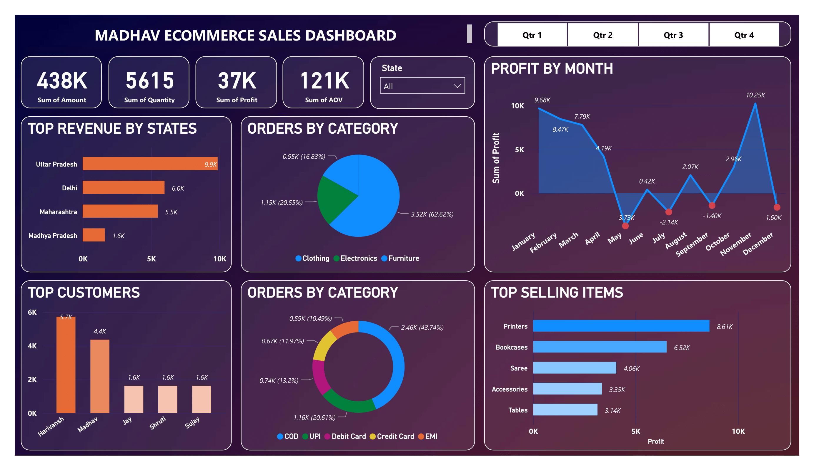

# Madhav-Store-Dashboard-On-PowerBI
_**Madhav Store: Building a Dynamic Sales Dashboard for Growth**_

## Author
- [@saadharoon27](https://github.com/saadharoon27)

## Table of Contents
- [Project Scope](#project-scope)
- [Data Source](#data-source)
- [Data Overview](#data-overview)
- [Method](#method)
- [Selection Of KPIs](#selection-of-kpis)
- [Quick Glance At The Dashboard](#quick-glance-at-the-dashboard)
- [Selection of Charts and Visualisation Options](#selection-of-charts-and-visualisation-options)
- [Steps in Data Cleaning](#steps-in-data-cleaning)
- [Data Filters](#data-filters)
- [Business Suggestions](#business-suggestions)

## Project Scope
The proprietor of **_Madhav Store_** has reached out with a request to collaborate on the development of a dynamic dashboard tailored to monitor and dissect their online sales activities across the diverse landscape of **_India_**. This initiative arises from the growing need to gain a comprehensive understanding of their sales performance and market trends. Recognizing the pivotal role that data-driven insights play in modern business strategies, the **_Madhav Store's management_** is keen to harness the power of data visualization to empower informed decision-making and fuel their growth trajectory. 

To lay the foundation for this ambitious undertaking, I aim to construct a dashboard that amalgamates various key performance indicators (**_KPIs_**) derived from the online sales data. The dashboard will encapsulate a holistic view of their sales landscape, spotlighting regions of high demand, identifying top customers, and delineating peak sales periods. This endeavour aligns seamlessly with **_Madhav Store's commitment_** to leveraging technology for competitive advantage and is poised to empower them with real-time insights, aiding in effective inventory management, targeted marketing campaigns, and refined customer engagement.

## Data Source
- [Madhav Store Dataset](https://www.kaggle.com/datasets/saadharoon27/madhav-store-dataset)

## Data Overview
- **Orders CSV Dataset** 
  - The "**Orders CSV**" dataset provides valuable insights into the ordering process of a retail company. It includes information related to customer orders, such as **order ID**, **order date**, **customer name**, **state**, and **city**. This dataset is a key resource for analyzing customer behavior, geographical distribution, and order history.

| **Column**            | **Description**                                            |
|-----------------------|------------------------------------------------------------|
| Order ID              | A unique identifier for each order.                        |
| Order Date            | The date when the order was placed.                        |
| Customer Name         | The name of the customer placing the order.                |
| State                 | The state in which the customer resides.                   |
| City                  | The city where the customer is located.                   |

- **Details CSV Dataset** 
  - The _"Details CSV"_ dataset complements the _"Orders CSV"_ dataset by providing detailed information about the orders. It includes data on _order ID, amount, profit, quantity, category, sub-category,_ and _payment_ _mode_. This dataset is crucial for analyzing sales _performance, profitability, product categories,_ and _payment methods_.

| **Column**            | **Description**                                            |
|-----------------------|------------------------------------------------------------|
| Order ID              | A unique identifier matching the order with the "Orders CSV" dataset. |
| Amount                | The total amount of the order.                            |
| Profit                | The profit generated from the order.                      |
| Quantity              | The quantity of products ordered.                         |
| Category              | The broad category to which the product belongs.          |
| Sub-Category          | A more specific sub-category of the product.              |
| Payment Mode          | The mode of payment used for the order.                   |

## Method
- Exploratory data analysis _(EDA)_

## Selection Of KPIs
- **Sum of Total Amount of Sales:** This sums up all sales transactions' values, providing an overview of the *revenue* generated by the store.

- **Sum Of Total Profit:** This metric combines *revenue* and costs to show the *net profit* earned by the store.

- **Sum of Order Quantity:** This adds up all units or items ordered, giving insights into *customer demand*.

- **Sum of Average Order Value:** By summing *average order values*, this metric reveals *customer spending patterns* and informs marketing strategies.

## Quick Glance At The Dashboard

## Selection of Charts and Visualisation Options

- 1. **Profit By Month – Stacked Column Chart:** Opted for a *stacked column chart* to visually portray the *monthly profit distribution* of the store. This choice of chart facilitates a more insightful comprehension of the store's financial performance across different months. By employing this chart type, it becomes more apparent which months yield the highest profits (*November*) and which exhibit comparatively lower returns/losses. This knowledge serves as a valuable compass, empowering the store to strategically allocate resources and efforts. By pinpointing peak and lean periods, the store can proactively adapt its strategies, optimizing operations and maximizing profitability. Conditional formatting was applied to enhance data interpretation, resulting in a visually enhanced representation.

- 2. **Top Selling Sub Categories – Stacked Bar Chart:** A *stacked bar chart* was chosen to visually represent the *top 5 most profitable subcategories* for the store. These subcategories encompass the products that yield the highest profits, thereby offering valuable insights for *inventory management*, potential expansion, and discount strategies. By identifying the subcategories that drive maximum profitability, the store gains a competitive edge in making informed decisions about stock levels, potential product diversification, and targeted promotional efforts. This analytical approach aligns with the store's aim to optimize its operations and cater to consumer preferences while maximizing returns.

- 3. **Percentage Of Total Orders – Pie Chart:** To provide a representation of the distribution of ordered categories based on *total order quantity*, a *pie chart* was selected. This visual tool effectively showcases the proportion of each category within the overall order quantity, offering an easily digestible snapshot of category popularity and consumer preferences. By utilizing a *pie chart*, the store gains a clear overview of the relative significance of different product categories in terms of sales volume, facilitating strategic decision-making and allocation of resources to cater to varying customer demands. This visualization aligns with the store's objective of understanding customer preferences and optimizing their product offerings accordingly.

- 4. **Payment Method Type – Pie Chart:** The available payment options included *Cash on Delivery (COD)*, *Unified Payment Interface (UPI)*, *Debit Card*, *Credit Card*, and *EMI*. By utilizing a *pie chart*, a clear visual representation was created, highlighting the distribution of customer choices among these various payment methods. The most used payment method by far was *COD (44%)*, followed by *UPI (21%)*.

- 5. **Top Revenue by States – Bar Graph:** This *bar graph* represents the *top revenue generating states*, which are *Uttar Pradesh*, followed by *Delhi*, *Maharashtra*, and *Madhya Pradesh*.

- 6. **Top Customers – Column Graph:** *Customers* with the highest number of sales done. Top 3 are *Harivansh*, *Madhav*, and *Jay*.

## Steps in Data Cleaning

- 1. In the 'orders' table, a slight change was made: the alteration of the '**order date**' column's data type from text to date. This transition refines the chart's presentation, shifting the focus from daily to *monthly profit analysis*. This adjustment considerably improves chart readability, making it easier to discern and analyze profit trends over time. This optimization aligns with our aim to enhance data interpretation and decision-making efficiency.

- 2. Added a new column labeled '**Average Order Value**' within the 'details' table. This addition was accomplished using a column tool and formulated by applying the equation *AOV = [Amount] / [Quantity]*. Subsequently, a refinement was made by adjusting the data type to *whole numbers*.
 
## Data Filters
- **Quarter Filter:** A *quarter filter* was implemented, enabling the selection of specific quarters for a more focused view of the data. This filter empowers the user to zoom in on particular time segments, facilitating *detailed analysis* and insights.

- **States Filter:** A *states filter* was employed to examine data on an individual *state level*. This feature allows for a granular exploration of data from various states, enhancing the ability to understand *regional trends* and preferences.

## Business Suggestions
- 1. **Strategic Focus on Top States:** Given that *Uttar Pradesh*, *Delhi*, *Maharashtra*, and *Madhya Pradesh* are the top-performing states, consider directing marketing efforts and inventory management strategies towards these regions. Tailoring promotions or exclusive offerings based on *regional preferences* could potentially drive even higher sales in these areas.

- 2. **Optimize Product Mix:** With *Clothing* being the dominant category at *62.62%*, there is an opportunity to further leverage this strength. Consider expanding the range of *clothing products* or introducing new collections to cater to *diverse consumer tastes*. Additionally, while *Electronics* and *Furniture* contribute significantly, exploring ways to enhance their appeal or introducing *complementary products* could amplify sales in these categories.

- 3. **Harness the Profitable Months:** Leverage the insight that *November* is the most profitable month. Plan marketing campaigns, new product launches, or special promotions during this period to maximize returns. For the *loss months* (*May*, *July*, *September*, and *December*), further analysis of what factors might be contributing to lower sales and consider strategies is required to mitigate these challenges.

- 4. **Cultivate Customer Relationships:** Engage with top customers like *Harivansh*, *Madhav*, and *Jay* to foster loyalty and repeat business. *Personalized offers*, *exclusive discounts*, or *loyalty programs* could incentivize continued engagement and potentially lead to increased sales.

- 5. **Payment Method Diversity:** Given that *Cash on Delivery (COD)* and *UPI* are popular payment methods, ensure a seamless experience for customers using these options. Additionally, consider incentivizing *Credit Card* and *EMI* usage by offering special deals or benefits, as this could potentially increase profitability through reduced transaction fees.

- 6. **Optimize Top Selling Items:** Since *Printers*, *Bookcases*, *Sarees*, *Accessories*, and *Tables* are the top-selling items, focus on ensuring consistent availability and perhaps exploring bundling options. Analyze customer feedback and preferences to refine these products further, ensuring they continue to meet customer expectations.
